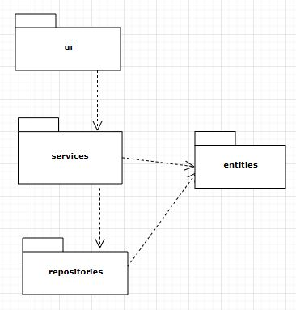
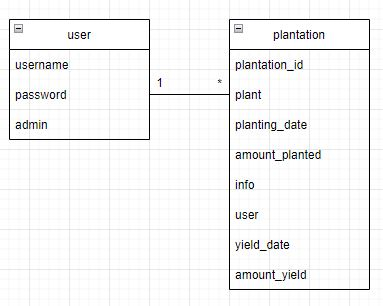

# The application architecture
## Structure  
The application is structured according to a standard model of having the ui, services, repositories and models (entities) in different packages.

In order to separate different layers of the functionality.
## Classes 
The application, being a quite straightforward system for storing information, revolves around two central classes: a user and a plantation. A user can create plantation-entries, one or many. 
 
## Logic
The inner logic of the gardeningapplication is handled by the GardeningService-class, that communicates with the UI and the repository to create the user-experience. 