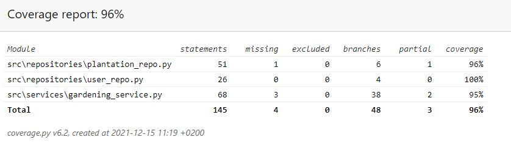

# Documentation on testing  

The application is tested using automated unit-testing and also by manual testing.  

## Automated testing  

### The application logic  

The main GardeningService-class is tested using the [GardeningServiceTest](https://github.com/rundtjan/ot-harjoitustyo/blob/master/puutarhasovellus/src/tests/gardening_service_test.py)-file. The UserRepository is simulated using a simple stub and the PlantationRepository is simulated with a mock-function.

## The repositories

The repositories `UserRepository` and `PlantationRepository` are tested using the actual database. They are tested using the [UserRepoTest](https://github.com/rundtjan/ot-harjoitustyo/blob/master/puutarhasovellus/src/tests/user_repo_test.py) and [PlantationRepoTest](https://github.com/rundtjan/ot-harjoitustyo/blob/master/puutarhasovellus/src/tests/plantation_repo_test.py) -classes. 

### Test coverage

The user interface is not tested, and the file functions.functions is also left outside the calculation of test-coverage, as it mostly consist of a helper function for building some of the views in the user interface. The test coverage is 96%. 

## System testing  

The application is tested manually.  

### Installation and configuration  

The application has been downloaded from github to different platforms (Windows, Windows Linux Subsystem and Linux), installed, built and used according to the instructions in the [Readme](https://github.com/rundtjan/ot-harjoitustyo) and the [User-instructions](https://github.com/rundtjan/ot-harjoitustyo/tree/master/puutarhasovellus/dokumentaatio).  

Because of some hazzle with the tkcalendar-plugin in the Linux-environment, this feature was left out, and instead a technically simpler solution, with dropdown-menus had to be implemented. This was visually a bit of a shame, but technically smoother.  

### Features  

The features are correctly listed in the [specifications](https://github.com/rundtjan/ot-harjoitustyo/blob/master/puutarhasovellus/dokumentaatio/vaatimusmaarittely.md). There are also some possible future features listed, but clearly specified, that these are not present in the current production version of the application.  

## Quality issues

At the moment the application does not give a suitable error message if the user has not ran the "invoke build" command, and there's no database present.
