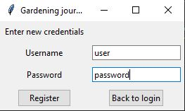
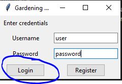
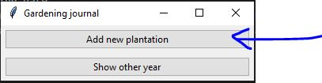
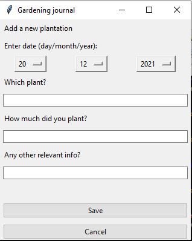
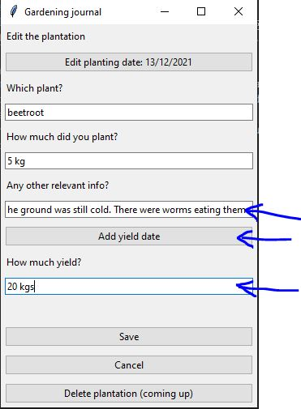
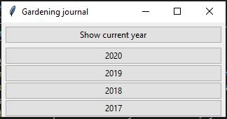

# User instructions  

First follow the instructions in the [readme](https://github.com/rundtjan/ot-harjoitustyo#readme) to install the application. Then after running it, choose "Register" to register:  

  

Then use your new credentials to login, like this: 
  
 
  
Then you might want to start by adding a new plantation. Click "Add plantation" and insert information.   
  
  
  
Please note that unless you choose a date yourself, the current date will be chosen as the planting date:  
  
  
  
When you have some plantation in your database, you can edit the plantation. Either add information about conditions and so forth or enter a date and amount for the yield:  
  
   
  
When you use the application for many years, you can choose to look at data from earlier years, just click "Show other year" and choose another year:  
  

